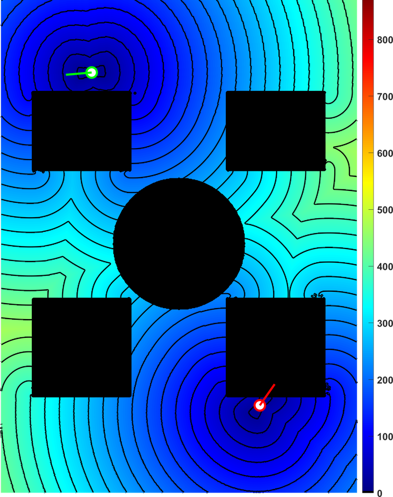
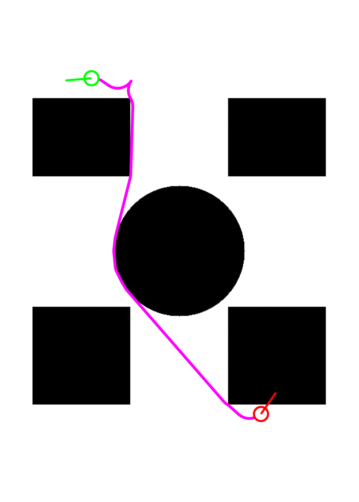
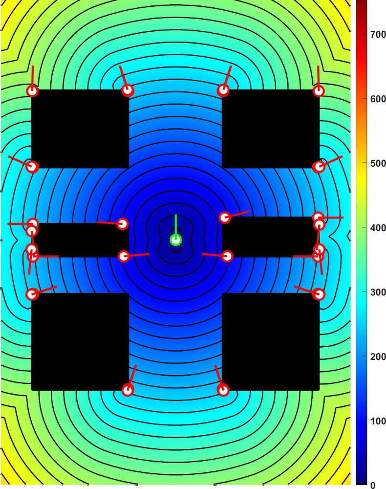
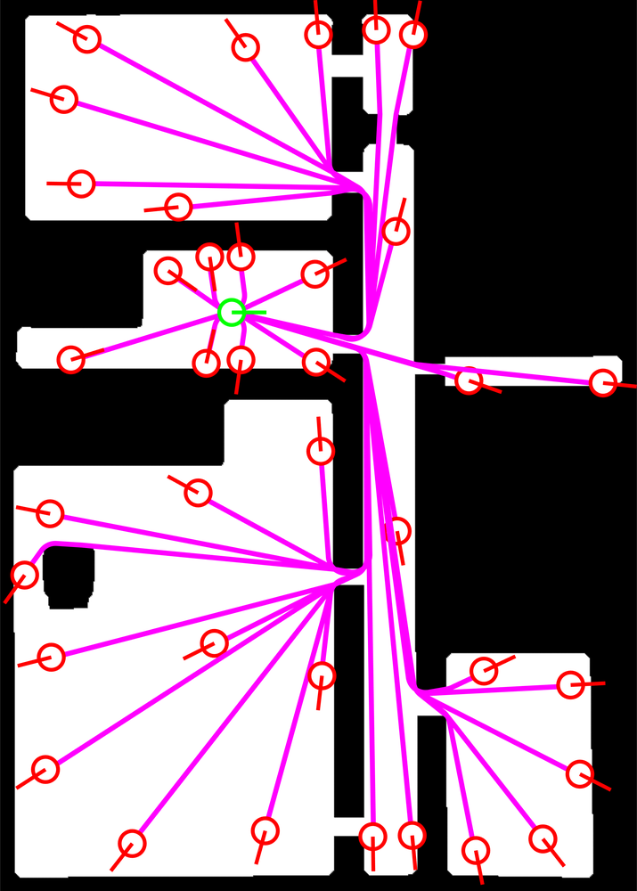
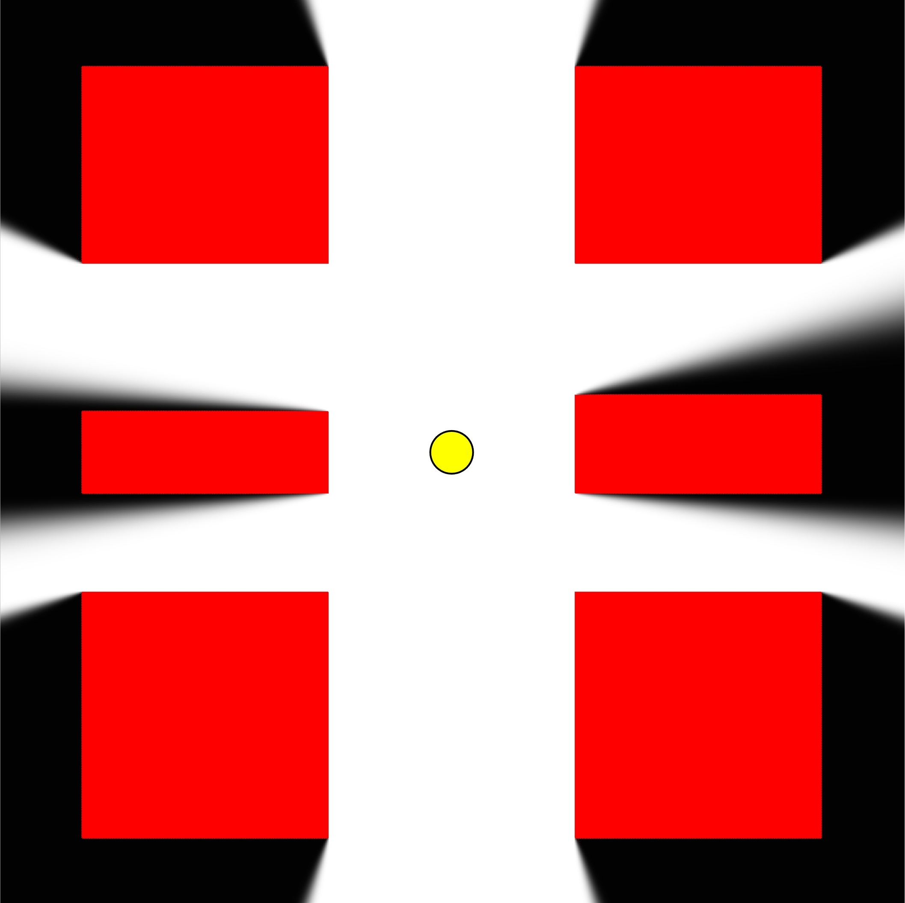
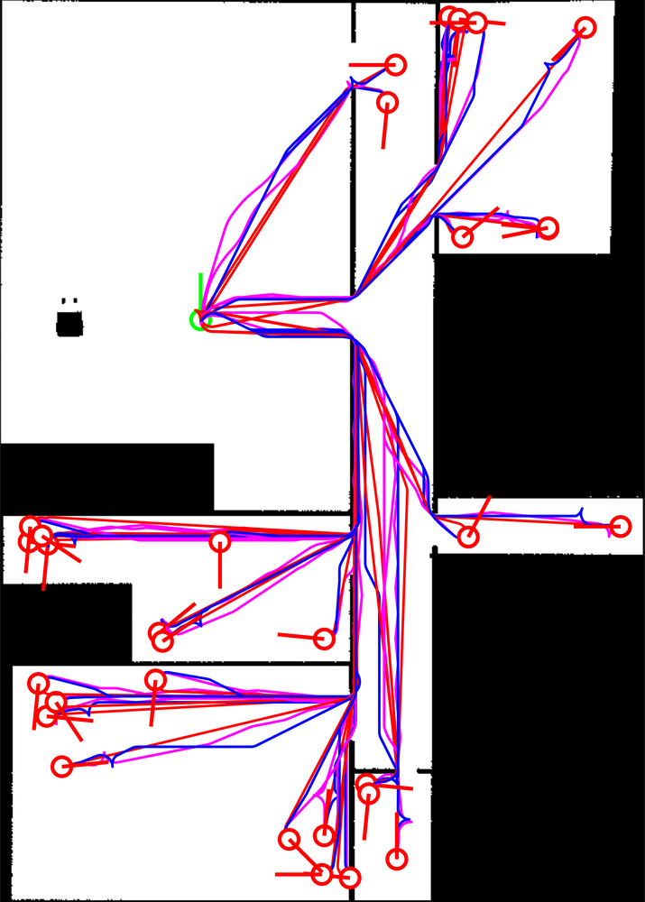
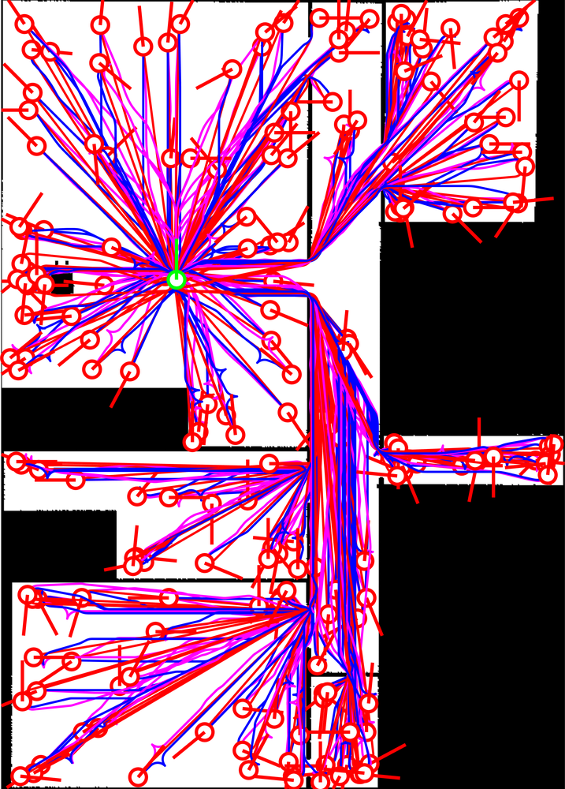
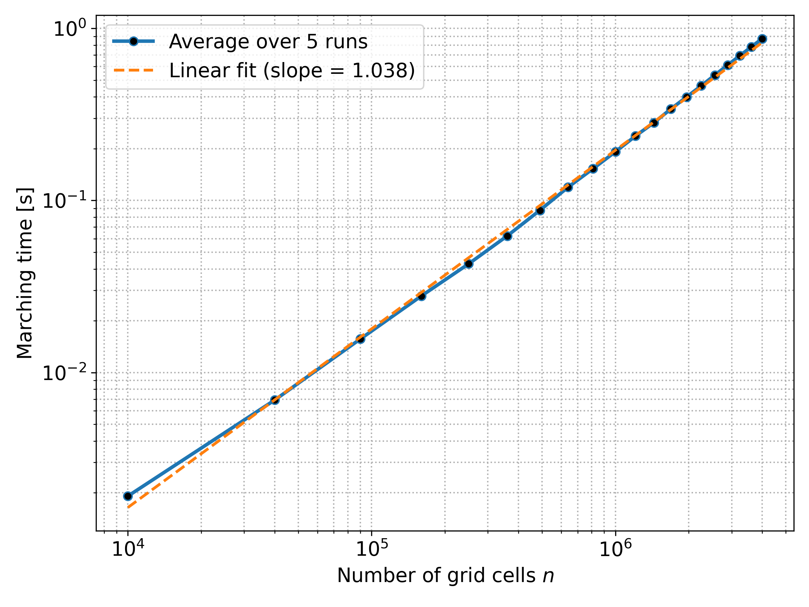
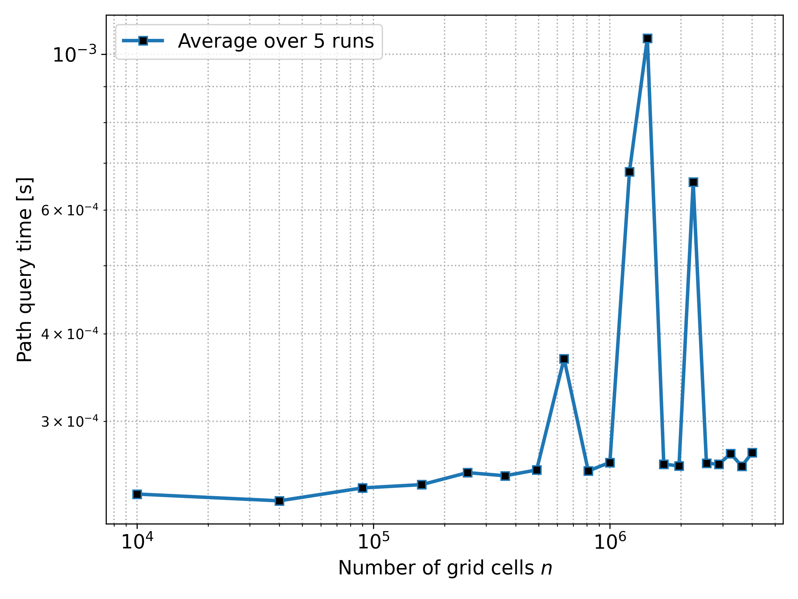

# Kinematically-Constrained Reeds-Shepp Marching

Code for the paper [**Kinematically Constrained Marching for Optimal Reeds–Shepp Nonholonomic Path Planning on 2-D Cartesian Grids**](https://ieeexplore.ieee.org/document/11534126), published in **IEEE Transactions on Robotics (T-RO)**.

This repository contains a C++20 implementation of a visibility-based marching solver for computing locally optimal Reeds-Shepp distances and paths for car-like, kinematically constrained vehicles on 2D Cartesian occupancy grids.

The method computes smooth Reeds-Shepp paths without discretizing vehicle orientations, motion primitives, or the Reeds-Shepp distance-propagation partial differential equation (PDE) used by Fast Marching Method (FMM)-type methods. Grid cells are used as workspace samples and pivot locations, while the vehicle model, headings, and path primitives remain continuous. A separate transport PDE visibility model is used only to determine direct Reeds-Shepp reachability.

This solver is a research-code release corresponding to the published T-RO paper. A newer implementation is in progress with broader handling of numerical singularities, degenerate geometric cases, and implementation edge cases.

## Method Lineage

The repository combines methods developed in the related papers and repositories:

- [visibility-heuristic-path-planner](https://github.com/IbrahimSquared/visibility-heuristic-path-planner), from the [ICRA 2024 visibility transport paper](https://ieeexplore.ieee.org/document/10611529): computes grid visibility as a transported quantity using a first-order hyperbolic transport/advection model.
- [visibility-based-marching](https://github.com/IbrahimSquared/visibility-based-marching), from the [RA-L 2024 VBM paper](https://ieeexplore.ieee.org/document/10679927): uses visibility structure to propagate exact one-to-all holonomic shortest-path information and predecessor/pivot structure over occupancy grids.
- [accelerated-RS-planner](https://github.com/IbrahimSquared/accelerated-RS-planner), from the [T-RO 2025 Reeds-Shepp paper](https://doi.org/10.1109/TRO.2025.3554406): provides the accelerated free-space Reeds-Shepp connector used for continuous path and distance evaluation.
- [underspecified-RS-planner](https://github.com/IbrahimSquared/underspecified-RS-planner), from the same T-RO 2025 Reeds-Shepp paper: provides the under-specified Reeds-Shepp routine used when a final position is fixed but the shortest final orientation must be selected.

The present repository lifts those ingredients into obstacle-aware Reeds-Shepp marching: straight visibility becomes curvilinear Reeds-Shepp visibility, holonomic pivots become kinematically feasible switching states, and free-space Reeds-Shepp connectors become the local primitives propagated through the grid.

## What This Code Does

The solver:

- computes Reeds-Shepp distance maps on occupancy grids;
- identifies regions that are directly reachable by Reeds-Shepp geodesics using the visibility-as-transport method adapted to curvilinear Reeds-Shepp motion;
- uses the visibility-based marching architecture to propagate distance, parent, and pivot structure over the map;
- selects pivot cells from the still-visible/reachable part of the propagated front so that the vehicle can manoeuvre around obstacle interruptions and reach positions that were not directly reachable from the original configuration;
- optimizes the continuous turning angle associated with each pivot-based manoeuvre;
- reconstructs smooth paths composed of Reeds-Shepp motion primitives;
- supports start-goal experiments by marching waves from two configurations until they meet;
- exports the selected primitive sequence as `primitives.json`;
- includes MATLAB scripts for visualizing distance maps, heading maps, reconstructed paths, and benchmark outputs;
- includes scripts used for scalability and sampling-based RRT/RRTConnect comparisons.

## Sample Results

### Start-Goal Marching

Marching from two Reeds-Shepp configurations until the waves meet. The distance map is shown on the left; the reconstructed optimal path is shown on the right.

<p align="center">
  
  
</p>

### One-to-All Distance Computation

The method can compute the Reeds-Shepp distance field from a starting configuration and then query paths to different goal configurations without recomputing the pivot hierarchy.

<p align="center">
  
  
</p>

### Reeds-Shepp Visibility

The marching scheme uses the visibility transport model from the 2D visibility work, adapted from straight-line visibility to curvilinear Reeds-Shepp visibility. This determines which grid cells are directly reachable under the vehicle kinematics before additional pivot-based manoeuvres are needed.

<p align="center">
  
</p>

### Planner Comparison

Representative path overlays from the paper comparing the proposed method against Smac state lattice and Hybrid A\* planners in ROS2/Nav2.

<p align="center">
  
  
</p>

## Main Idea

Classical grid-based planners for car-like robots usually discretize the vehicle orientation, the control primitives, or the Hamilton-Jacobi/Eikonal PDE used to approximate anisotropic distance propagation. This gives practical planners, but the path quality depends strongly on the chosen discretization and tuning parameters.

This solver instead propagates a Reeds-Shepp distance function over a 2D occupancy grid. In directly reachable regions, it evaluates the continuous free-space Reeds-Shepp distance. When obstacle geometry interrupts direct reachability, the marching process selects pivots from the still-visible/reachable part of the propagated front. These pivots act as switching states that allow the vehicle to manoeuvre around the obstacle and reach positions that were previously unreachable from the original configuration. The turning angle at each pivot is optimized, and the final path is reconstructed as a sequence of continuous Reeds-Shepp primitives.

In practice, the marching cost scales approximately linearly with the number of grid cells, while path extraction depends on the number of reconstructed waypoints. The paper reports scaling experiments up to `2000 x 2000` grid cells.

<p align="center">
  
  
</p>

## Repository Structure

- `src/` and `include/`: C++ implementation of the marching solver, environment loader, parser, accelerated Reeds-Shepp solver, and under-specified Reeds-Shepp planner.
- `config/settings.config`: main runtime configuration parsed by the executable.
- `images/`: occupancy maps used in the examples and experiments.
- `scaled_maps/`: generated maps used for scalability tests.
- `misc/`: MATLAB helpers for map processing and path plotting.
- `run_matlab_sample.m`: runs the executable and plots distance maps, heading maps, and paths.
- `run_scalability.m`: runs the scalability experiment.
- `run_RS_benchmark_set.m`: runs the Reeds-Shepp benchmark set used by the sampling-based comparison.
- `rrt_bench.py`: OMPL-based RRT\*/RRTConnect benchmark script.
- `samples/`: README figures copied from the paper assets.

## Build

The code is developed for C++20 and uses CMake.

Required:

- CMake;
- a C++20 compiler such as `g++`;
- SFML graphics;
- Abseil C++;
- `ankerl::unordered_dense` with a CMake package target named `unordered_dense::unordered_dense`.

On Ubuntu, the common packages are:

```bash
sudo apt update
sudo apt install cmake g++ libsfml-dev libabsl-dev
```

Install `ankerl::unordered_dense` through your preferred package manager or from source so that CMake can find `unordered_dense CONFIG`.

Then build:

```bash
mkdir -p build
cd build
cmake ..
cmake --build . -j
cd ..
```

The executable is written to the repository root as:

```bash
./RS_marching
```

## Run

The executable reads:

```text
config/settings.config
```

Run from the repository root:

```bash
./RS_marching
```

For image-based experiments, set:

```text
mode=2
imagePath=images/waffle_inflated.jpeg
```

The main start-goal configuration is set with `initialFrontline`, using two configuration triples:

```text
{x_start, y_start, theta_start_deg, x_goal, y_goal, theta_goal_deg}
```

For example:

```text
initialFrontline={200, 100, 0, 190, 500, 0}
radius=10
visibilityThreshold=0.5
pose_randomness=0
```

Angles in the config are in degrees. The image/map origin follows the convention used by the code and MATLAB scripts: the bottom-left corner is treated as the origin for selecting start and goal configurations.

## Output

The solver writes text outputs to:

```text
output/
```

Typical outputs include:

- `distance.txt`: computed Reeds-Shepp distance/cost map;
- `occupancy.txt`: occupancy map used by the solver;
- `cameFrom.txt`: parent/source information used for reconstruction;
- `origin.txt`: propagated origin labels;
- `thetas_.txt`: heading values used during reconstruction;
- `lightSources.txt`: pivot/source locations;
- `path_1.txt` and `path_2.txt`: forward-simulated candidate paths when applicable.

The selected Reeds-Shepp primitive sequence is exported as:

```text
primitives.json
```

This JSON file contains motion types, motion lengths, motion directions, waypoints, and the minimum turning radius.

## MATLAB Visualization

`run_matlab_sample.m` runs the executable, reads the generated output, and plots the distance map, heading map, and reconstructed path. It also reads `primitives.json` and uses the MATLAB plotting helpers in `misc/`.

Before running the MATLAB scripts, check the project paths near the top of each script and update them to your local clone if needed.

## Benchmarking Scripts

The repository includes scripts used to produce the paper's benchmark and scalability results:

- `run_scalability.m` updates `config/settings.config` over a sequence of scaled maps and records marching/query time.
- `run_RS_benchmark_set.m` runs the proposed solver over a fixed benchmark set and stores the resulting primitive files and timing logs.
- `rrt_bench.py` runs sampling-based Reeds-Shepp RRT\*/RRTConnect comparisons using OMPL.

These scripts are research/experiment scripts rather than a packaged benchmark harness, so check all paths and dependencies before running them.

## Notes and Limitations

This release reflects the implementation used for the published T-RO paper and is intended to make the proposed method reproducible and inspectable. The in-progress successor implementation is focused on broader coverage of singular, degenerate, and edge-case geometries.

The current implementation uses a circular footprint/envelope for collision checking. This is conservative for elongated robots in narrow spaces. The paper discusses orientation-dependent rectangular or polygonal footprint checking as a future extension.

The implementation has mainly been tuned and tested on occupancy-grid environments similar to those in the paper. Rare degenerate geometric cases can require additional numerical regularization, especially around very small obstacles, highly curved obstacle boundaries, or features comparable to the turning radius.

## Citation

If you use this code, please cite the paper:

```bibtex
@ARTICLE{11534126,
  author={Ibrahim, Ibrahim and Decré, Wilm and Swevers, Jan},
  journal={IEEE Transactions on Robotics},
  title={Kinematically Constrained Marching for Optimal Reeds–Shepp Nonholonomic Path Planning on 2-D Cartesian Grids},
  year={2026},
  volume={42},
  number={},
  pages={2215-2230},
  keywords={Distance measurement;Cells (biology);Modeling;Turning;Algorithms;Vehicles;Timing;Optimization;Noise;Path planning;Computational geometry;constrained motion planning;motion and path planning;nonholonomic motion planning},
  doi={10.1109/TRO.2026.3695992}
}
```

[Published version](https://ieeexplore.ieee.org/document/11534126)

## Related Repositories

- [visibility-based-marching](https://github.com/IbrahimSquared/visibility-based-marching)
- [accelerated-RS-planner](https://github.com/IbrahimSquared/accelerated-RS-planner)
- [underspecified-RS-planner](https://github.com/IbrahimSquared/underspecified-RS-planner)
- [visibility-heuristic-path-planner](https://github.com/IbrahimSquared/visibility-heuristic-path-planner)
